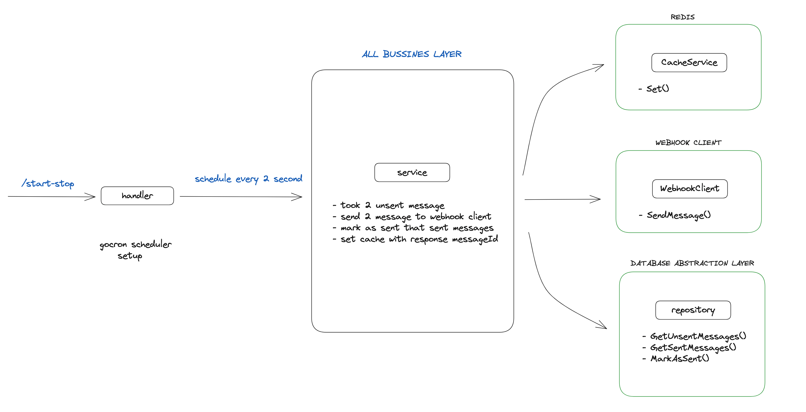

# Message-System

## Description
We are seeking the design of an automatic message sending system for this project.

## Run
```zsh
docker-compose -d up
```

## API Endpoints
```zsh
curl --location 'http://localhost:8080/start-stop'
```

```zsh
curl --location 'http://localhost:8080/sent-messages'
```

## Project Architecture
